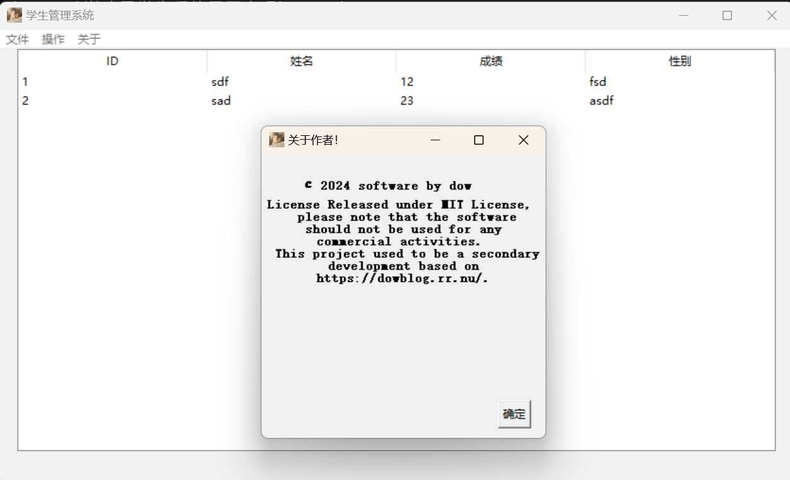

# student-manager

## 介绍

~~对的这是课程作业~~

学生管理系统是一个基于tkinter的学生管理系统，主要功能有：

- 学生信息管理：包括添加学生信息、删除学生信息、修改学生信息、查询学生信息等功能。
- 系统设置：包括修改密码、退出系统等功能。

## 运行

```
pip install json
pip install pysqlite3

python main.py
```

## 截图


